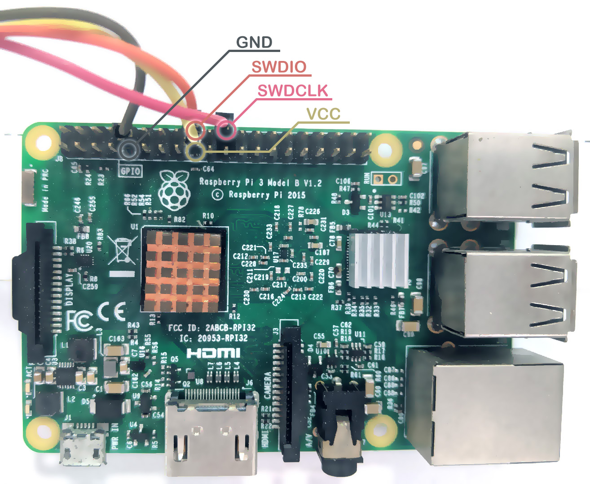
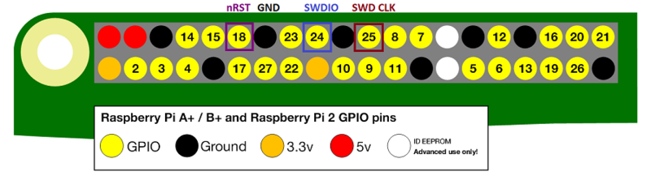

# OPENOCD on RaspberryPi

本笔记记录了使用`openocd`在`树莓派`上烧录`stm32`芯片和`nrf52`芯片的操作过程

### 1. 编译openocd

因为种种原因，为了避免在树莓派上使用预编译的二进制所可能遭遇的兼容问题，我们需要在树莓派上自己编译一次`openocd`，过程比较简单

```shell
sudo apt update
sudo apt install git autoconf libtool make pkg-config libusb-1.0-0 libusb-1.0-0-dev
git clone https://github.com/ntfreak/openocd
cd openocd
./bootstrap
./configure --enable-sysfsgpio --enable-bcm2835gpio
make -j4
sudo make install
```

`install`完成之后，`sudo reboot now`重启一下，更新环境变量。在树莓派3上，`make`的过程可能需要十几分钟。

### 2. 配置参数

当使用`bcm2835gpio`接口时，使用这个配置文件。

File:`raspi3.cfg`（完整配置文件见同目录同名文件）

```shell

interface bcm2835gpio

bcm2835gpio_peripheral_base 0x3F000000

# RPI2 900MHz
bcm2835gpio_speed_coeffs 146203 36
# RPI3B 1200MHz
#bcm2835gpio_speed_coeffs 194938 48
# RPI3B+ 1400MHz
#bcm2835gpio_speed_coeffs 227428 56

bcm2835gpio_swd_nums 25 24

```


当使用`sysfsgpio`接口时，使用这个配置文件。

File:`raspi-sysfsgpio.cfg`

```shell

interface sysfsgpio

sysfsgpio_swd_nums 25 24

```

### 3. 编写烧录脚本

#### 使用`bcm2835gpio`接口烧录`stm32f1`芯片示例：

创建烧录脚本:`f103_prog.cfg`

```shell
source ./raspi3.cfg
transport select swd
adapter_khz 4000
source [find target/stm32f1x.cfg]
program ./LED.hex verify reset exit
```

然后执行`sudo openocd -f f103_prog.cfg`即可

#### 使用`bcm2835gpio`接口烧录`nrf52`芯片示例：

创建烧录脚本:`nrf52_prog.cfg`

```shell
source ./raspi3.cfg
transport select swd
source [find target/nrf52.cfg]

init
reset halt
nrf5 mass_erase
reset halt
program ./nrf52_firmware.hex verify
reset run
exit
```

然后执行`sudo openocd -f nrf52_prog.cfg`即可

#### 使用`sysfsgpio`接口烧录`nrf52`芯片示例：

创建烧录脚本:`nrf52_prog_fs.cfg`

```shell
source ./raspi-sysfsgpio.cfg
transport select swd
source [find target/nrf52.cfg]

init
reset halt
nrf5 mass_erase
reset halt
program ./nrf52_firmware.hex verify
reset run
exit
```

然后执行`sudo openocd -f nrf52_prog_fs.cfg`即可

### 4. 连线烧录






配置文件中没有指定`nRST`引脚，所以不用连接。只需要`VCC`,`GND`,`SWDIO`,`SWDCLK`四根连线即可。

### 5. 已知问题

使用`bcm2835gpio`接口时，在`RPI2B`上可以工作，在`RPI3`上烧录`nrf52`时会报错。并且尝试更改时钟相关参数`bcm2835gpio_speed_coeffs`未能修复。

但是使用`bcm2835gpio`接口可以在`RPI3`上烧录`stm32f1`芯片。

使用`sysfsgpio`接口在上述`RPI`上都能正常烧录`nrf52`，但是速度会比较慢，因为`bcm2835gpio`接口更加接近内核，效率更高。


仍然怀疑`RPI3`上使用`bcm2835gpio`接口烧录`nrf52`报错的问题可能与`io`时钟设置相关。


